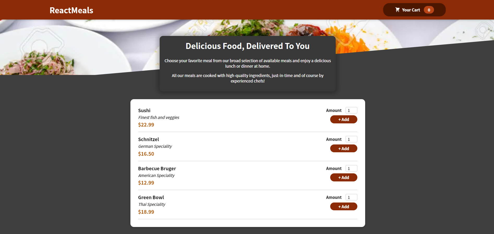

# Food Order App

---

### Table of Contents
You're sections headers will be used to reference location of destination.

- [Description](#description)
- [Technologies](#technologies)
- [Features](#features)

---

## Description

Food Order App , an application with different functionalities , i created carts where i populated with different items , then managed to add the items based on quantity to cart .On the cart part is viewable to see the total price and to send the data in backend using a realtime database in firebase.

#### Technologies

- Javascript
- React
- Redux
- JSX
- CSS
- Firebase

### Features
  - Data manipulation
  - Store
  - CRUD 
 

[Back To The Top](#read-me-template)

---

